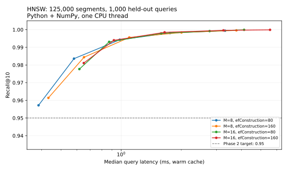

# Phase 2 — HNSW

The graph is implemented in `src/timbre/hnsw.py`, using Python heaps/sets and
NumPy-vectorized cosine distances. No third-party ANN implementation is used.
Algorithm reference: [Malkov and Yashunin, HNSW](https://arxiv.org/abs/1603.09320).

## Construction and search

- Exponentially sampled layers with level multiplier `1 / log(M)`.
- Greedy descent on upper layers and bounded beam search at the connection layers.
- Diversified neighbor selection: reject a candidate if an already selected
  neighbor is closer to it than the query is. This keeps routes in different
  directions instead of filling every slot with redundant nearby points.
- New nodes establish up to `M` reciprocal links. Overflow pruning uses the same
  heuristic, with outgoing degree limits of `2*M` at layer zero and `M` above it.
  Pruned links need not remain reciprocal, as in the reference algorithm.
- Query `ef_search` controls the candidate beam and must be at least `k`.
- Seeded construction and pickle-free graph serialization. Saves preserve the
  random generator state for continuation and check the exact vector fingerprint
  on load. Checkpoints are written through a temporary file and atomically replaced.

The vector matrix and its external IDs are fixed when an index is created; build
inserts rows into that immutable corpus. Returned IDs are **segment row IDs**,
not track IDs. Query vectors are normalized before search; stored vectors must
already be normalized. The class is intended for single-threaded use.

```python
import numpy as np
from timbre.hnsw import HNSW

vectors = np.array([[1, 0], [0, 1], [-1, 0]], dtype=np.float32)
index = HNSW(vectors, ids=[21, 42, 63], M=8, ef_construction=80, seed=0)
index.build(np.random.default_rng(0).permutation(len(vectors)))
ids, cosine_scores = index.search([1, 0], k=2, ef_search=16)
index.save("graph.npz")
restored = HNSW.load("graph.npz", vectors)
```

## Benchmark protocol

The spec's Phase 2 size is 125,000 vectors; the full rebuilt store contains
510,064. The benchmark samples exactly 125,000 populated rows, excludes all
1,000 fixed Phase 1 query rows, and keeps the original query set. Queries are
held out at the segment level; other windows from the same track remain eligible.
In this sample, 41.62% of exact top-10 hits are same-track siblings; no query has
an entirely sibling top-10. There is zero overlap between query and candidate rows.

Exact top-100 neighbors are recomputed over this precise candidate set using
Phase 1's `exact_topk`. Scoring the subset graph against the full-corpus cache
would penalize it for neighbors it was never given, so the two caches are kept
separate. The benchmark cache records both membership arrays and source identity.

The default sweep is `M={8,16}`, `efConstruction={80,160}`,
`efSearch={16,32,64,128,256}`. Candidate sampling, insertion order, and layers are
seeded; every configuration sees the same candidate/query split. The default
insertion order is shuffled, with `--order track` available for the ordering
experiment. BLAS/OpenMP are pinned to one thread before heavy imports.

Reported latency includes one vector search and result materialization, after
ten warmup queries. It excludes embedding, loading, construction, and track
aggregation. Build time includes initialization and periodic checkpoints. For a
resumed partial build, total build time is marked unknown rather than reporting
only the restart as a complete build. Peak RSS describes the entire benchmark
process, including source arrays and imports; it is not graph-only memory.

```bash
# Full sweep; safe to rerun. Saved graphs resume in their original insertion order.
PYTHONPATH=src python3 -m timbre.benchmark_hnsw

# Smaller pilot with a separate exact oracle and artifact directory.
PYTHONPATH=src python3 -m timbre.benchmark_hnsw \
  --vectors 5000 --queries 100 --m 8 16 --ef-construction 80 \
  --ef-search 16 64 128 --out store/hnsw_pilot

# Render results with matplotlib (optional `plots` dependency extra).
python3 tests/plot_hnsw.py store/hnsw_phase2/results.json docs/hnsw_frontier.svg

# Focused correctness tests.
USE_TF=0 OPENBLAS_NUM_THREADS=1 PYTHONPATH=src \
  python3 -m pytest tests/test_hnsw.py tests/test_hnsw_benchmark.py -q
```

Artifacts live under `store/hnsw_phase2`: the sampled exact oracle, graph
checkpoints, per-graph build metadata, and `results.json`. The report contains
all measured points and the nondominated recall@10/median-latency frontier.
The command exits successfully only if a measured configuration reaches 0.95
recall@10. Production vectors, Phase 1 ground truth, and the exact listening
tool are unchanged by the benchmark.

## Validation

The complete non-GPU regression suite passes: **38 passed, 3 deselected**.
This includes 12 new HNSW and benchmark tests; embedding GPU tests are unchanged.

Tests cover the diversification heuristic, degree/layer invariants, insertion,
exact results with an exhaustive beam on a small graph, held-out clustered
recall, duplicate vectors, save/load search equivalence, continued insertion
after reload, vector/source mismatch rejection, and the held-out oracle.

The full 125,000-vector sweep passed the recall gate, with all 20 parameter
combinations measured. The 125,000-node `M=8, efConstruction=80` graph was also
reloaded and checked against all 1,000 queries at `efSearch=64`: recall@10
remained exactly 0.9943. Index recall measures agreement with exact vector
neighbors, separate from musical relevance.

## Measured results

Hardware: AMD Ryzen 7 5800H (eight physical cores, 16 logical CPUs), approximately
7.4 GiB RAM available. The benchmark uses one CPU/BLAS thread and float32 vectors.

| M | efConstruction | Build time | Serialized graph size |
|---|---|---|---|
| 8 | 80 | 189.1 s | 8.89 MiB |
| 8 | 160 | 338.2 s | 9.11 MiB |
| 16 | 80 | 225.2 s | 11.02 MiB |
| 16 | 160 | 519.6 s | 12.00 MiB |

Graph files include adjacency, IDs, levels and metadata, but exclude the vector
matrix (244.14 MiB for 125,000 × 512 float32 values). Peak RSS across the whole
benchmark process was 2,990 MiB, including imports, the source mmap, and copies.

A useful measured configuration is **M=8, efConstruction=80, efSearch=64**:
**99.43% recall@10, 0.984 ms median, 1.179 ms p95**. The same graph at efSearch=16
already meets the 95% gate (95.72%, 0.386 ms median). Larger M or construction
effort does not uniformly improve the latency/recall tradeoff on this sample.



The [complete report](docs/hnsw_results.json) includes all points, the frontier,
recall@1, p95/p99, throughput and distance counts. Timings are a single warm-cache
run on shared laptop hardware; small differences should not be treated as
statistically established wins. These are 125k-subset results, not full-store or
large-corpus results. Third-party baselines and insertion-order comparisons remain
separate experiments.
